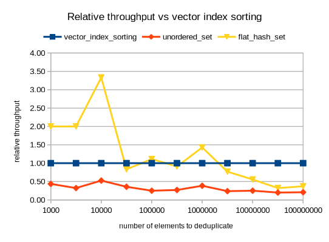

# C++ vector deduplication by index sorting

This repo benchmarks ways to remove duplicates from a C++ container, such as `std::vector`.

It shows that sorting an index vector can be much faster than hash sets:

* Baseline: Index sorting from [`iterator_sorting.h`](./iterator_sorting.h) (credits: [StackOverflow _user541686_](https://stackoverflow.com/questions/12200486/how-to-remove-duplicates-from-unsorted-stdvector-while-keeping-the-original-or/15761097#15761097))
* [`std::unordered_set`](https://en.cppreference.com/w/cpp/container/unordered_set): **5x** slower
* [`phmap::flat_hash_set`](https://github.com/greg7mdp/parallel-hashmap): **2x** slower

_Index-sorting deduplication_ is fast in the common case of:

* Only a small fraction of elements are duplicates.

But if the number of distinct elements small enough to fit into a CPU cache, using a hash set can be faster.


## API

[`iterator_sorting.h`](./iterator_sorting.h) provides:

```c++
vector<It> stable_unique_iterators(It begin, It end);
       It  stable_uniquify(It begin, It end);
vector<T>  stable_uniquify(vector<T> & v);
```

Note vector iterators are usually simply 64-bit indices.


## Running the benchmark

```
make
```

Dependencies reproducibly pinned with [Nix](https://nixos.org):

```sh
NIX_PATH=nixpkgs=https://github.com/NixOS/nixpkgs/archive/9c0ce522cab22ccaba5f89188d24ef5bb919d914.tar.gz nix-shell -p parallel-hashmap --pure --run make
```


## Results

On `Intel Core i7-7500U`, single-run benchmark (we only care about rough numbers):

```
           n   |--- speedup factor over ---|   notes
               unordered_set   flat_hash_map

        1000   2.3             0.5             flat_hash_map is faster
        3162   3.1             0.5             flat_hash_map is faster
       10000   1.9             0.3             flat_hash_map is faster
       31623   2.8             1.2
      100000   4.0             0.9             flat_hash_map is faster
      316228   3.7             1.1
     1000000   2.6             0.7             flat_hash_map is faster (last time)
     3162277   4.2             1.3
    10000000   4.0             1.8
    31622776   5.0             3.1
   100000000   4.8             2.7
```




### Summary

* Vector index sorting beats hash maps, unless the number of distinct elements is < 1 M.
